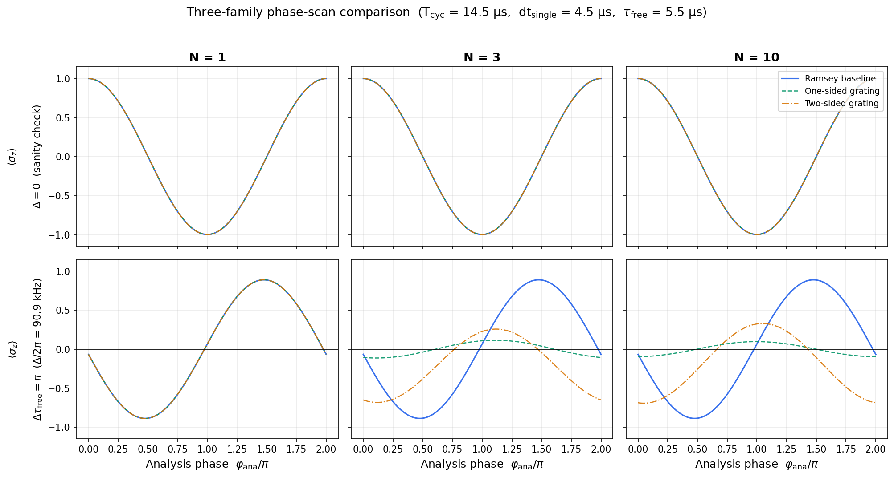
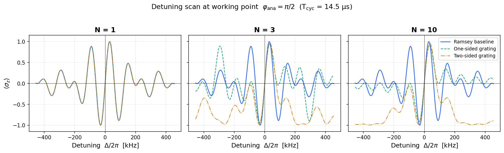

# Active Phase Grating vs. Standard Ramsey


**Stewardship:** U. Warring.\
**Version:** 0.6 (draft) — February 2026\
**External constraints:** Dick (1987); Santarelli et al. (1998); Yudin et al. (2010); Huntemann et al. (2012); Hasse et al. (2024, PRA 109, 053105); Schioppo et al. (2017)

**Numerics code:** [https://colab.research.google.com/drive/1f\_PGhjySBkMwoAUppYEnA9lx-fcw68nu?](https://colab.research.google.com/drive/1f_PGhjySBkMwoAUppYEnA9lx-fcw68nu?usp=sharing)[usp=sharing](https://colab.research.google.com/drive/1f_PGhjySBkMwoAUppYEnA9lx-fcw68nu?usp=sharing)


***

#### Abstract

In trapped-ion precision spectroscopy, the analysis step of a Ramsey sequence is conventionally a single π/2 pulse. Stroboscopic protocols replace this with a train of N weak pulses whose inter-pulse spacing can be matched to a physical frequency of interest — for instance, a motional mode period. The resulting multi-pulse structure resembles a diffraction grating in the time domain: N coherent contributions interfere to produce a spectral response that is narrower, and potentially steeper, than the standard Ramsey sinusoid.

This analogy is pedagogically powerful but physically incomplete. Unlike the slits of a passive grating, each pulse is an active SU(2) rotation that does not commute with the free precession between pulses. The interference pattern therefore depends on the full unitary evolution chain, not merely on the Fourier transform of the pulse positions. Phase manipulations that would produce predictable results in optics — blazing, alternating-phase cancellation — behave differently here, and the discrepancy grows with detuning.

We develop the analogy carefully, identifying where it is safe (the linear regime of small pulse areas and small detunings) and where it breaks (finite detuning, phase manipulation, error accumulation). The central methodological commitment is a fixed-cycle-time fairness constraint: the grating sequence is compared against standard Ramsey under identical total time, identical total pulse area, and identical laser power. Under this constraint, the grating's claim is not longer interrogation but engineered spectral redistribution of the sensitivity function g(t) within the same time budget. Whether this redistribution improves or degrades clock stability depends on the match between the reshaped g(t) and the actual local-oscillator noise spectrum — a question that is apparatus-specific and must be computed, not assumed.

We present a qubit-only numerical baseline implementing three comparison families (standard Ramsey, one-sided grating, two-sided grating) under the fairness protocol. At zero detuning, all families produce identical phase-scan curves to machine precision, validating the equal-resource constraint. At finite detuning, the grating families develop frequency-selective structure absent in standard Ramsey, demonstrating the spectral redistribution mechanism. Under the equal-gap convention used for the baseline, the discriminator slope at the working point decreases with N — confirming that slope enhancement is not automatic but requires matching the gap structure to the target frequency.

The framework is intended as a working reference for experimental groups implementing stroboscopic protocols in trapped-ion systems, and as a pedagogical entry point for researchers encountering multi-pulse Ramsey extensions for the first time.

***

### 1. Purpose and Scope

This essay establishes the **active phase grating** as a pedagogical and operational framework for understanding multi-pulse analysis trains in stroboscopic trapped-ion spectroscopy. It maps the analogy to spatial diffraction gratings, locates where the mapping is safe, identifies where it breaks, and defines the quantitative figures of merit required to compare the grating approach against standard Ramsey interferometry on metrological ground.

The intended audience is the experimental crew working on FH24-derived stroboscopic protocols (Hasse et al. 2024, PRA 109, 053105), including new doctoral researchers. The essay should be read alongside the qubit-only simulation code, which provides numerical ground truth for the claims made here.

> **Harbour Policy.** This document is a Sail (working essay), not a Coastline (stable framework). It may be revised as experimental data accumulates. The Lock is the metrological comparison methodology; the Keys are the specific parameter choices, which remain free.

> **📘 Student note.** A "Sail" in our group's documentation system is a working essay — mature enough to guide lab work, but still subject to revision as data comes in. A "Coastline" is a stable, validated framework. Think of it this way: you can navigate by a Sail, but you don't draw the map from it yet.

#### 1.1 Tier Classification

This document operates across two Harbour tiers. The boundary is architecturally significant.

* **Tier 1b (Metrological Clocks / Measurement):** The grating response function, sensitivity function g(t), Dick-effect analysis, and all figures of merit that characterise the measurement operator. _These are properties of the physics._
* **Tier 2 (Coordination / Feedback):** Capture-range constraints, side-lobe false-lock analysis, discriminator lock stability, and closed-loop Allan deviation. _These are properties of the control system that acts on the physics._

Sections are labelled \[T1b] or \[T2] where the distinction matters.

> **📘 Student note.** Why does this distinction matter? Because a measurement can have excellent resolution (T1b) but be operationally useless if the feedback loop cannot exploit it (T2). Whenever you see a "T1b → T2 degradation" warning in this document, it means the physics is fine but the engineering cannot keep up.

***

### 2. Two Distinct Uses of a Pulse Train in Ramsey Spectroscopy

Before developing the grating framework, we must distinguish two fundamentally different reasons for replacing a single π/2 pulse with a train of sub-pulses. Conflating them leads to incorrect assessments of when the technique is powerful and when it is not.

> **📘 Student note.** This is the single most important section for avoiding confusion. If someone in the group says "the pulse train makes things better," your first question should be: "Better at _what_?" The answer determines which of the two uses they mean — and the analysis is completely different.

#### 2.1 Use A: Composite π/2 Replacement (Robustness Engineering)

Replace a single π/2 with a train of sub-pulses summing to π/2, all at the same detuning, to gain robustness against pulse imperfections. The gains are entirely in the error model:

* **Filter-function engineering:** The train modifies the experiment's sensitivity function g(t) and can place notches at frequencies where LO phase noise or technical lines dominate.
* **Amplitude/detuning robustness:** Intelligent choice of phases and timings (BB1, SK1, WALTZ, Hyper-Ramsey) can make the effective π/2 less sensitive to Ω miscalibration and static detuning.
* **Transient suppression:** Distributing area over several weaker pulses can average or cancel AOM rise-time, chirp, Stark-shift transients, and AM-to-PM conversion.

**When Use A helps:** If the dominant limitation is pulse imperfections, light-shift transients, or spectrally structured decoherence during the Ramsey zones.

**When Use A does not help:** If pulses are already clean and the system is projection-noise limited, a π/2 is a π/2. Splitting it buys nothing fundamental; it only reshapes technical error couplings. It can actively hurt if extra pulses add light shifts, spontaneous scattering, or convert amplitude noise into phase noise.

This is well-trodden composite-pulse territory. The relevant literature is Yudin et al. (2010), Huntemann et al. (2012), and the comprehensive review by Zanon-Willette et al. (2018).

#### 2.2 Use B: Stroboscopic Spectral Selector (Measurement Engineering)

Replace the analysis operation with a train whose inter-pulse spacing Δt is matched to a **physical frequency of interest** — the motional mode period in FH24. The total area is still π/2, but the train's purpose is not robustness. It is **spectral selectivity**: the train acts as a narrow-band filter centred on 1/Δt, enhancing sensitivity to that frequency component while suppressing others.

**When Use B helps:** When you need frequency-selective readout of a specific motional component, or when you want to engineer the discriminator slope for a known target frequency.

**When Use B does not help:** If the target frequency is already well-resolved by standard Ramsey, or if the additional control complexity introduces errors that exceed the spectral-selectivity gain.

**This Sail addresses Use B.** The representative FH24-regime parameters are: Raman-driven transitions, Ω/2π in the low-MHz range, pulse durations ∼100 ns, Δt ∼ 770 ns matched to ω\_LF ∼ 2π × 1.3 MHz. (These are representative lab parameters for orientation; consult Hasse et al. 2024 for the published experimental specifics.) The regime is not limited by pulse imperfections. It is limited by the need to resolve motional dynamics stroboscopically. The grating framework is the right tool for this regime.

The two uses are **not mutually exclusive**. One could apodise pulse areas for side-lobe suppression (Use B optimisation) while simultaneously phase-stepping for light-shift cancellation (Use A optimisation). But the design intents are distinct and should not be conflated in analysis.

#### 2.3 Which Knobs Belong to Which Use

To prevent accidental hybridisation in simulation code, the following table separates the control knobs by design intent:

| Knob                       | Use A (Robustness)                                                    | Use B (Spectral Selectivity)                                                      |
| -------------------------- | --------------------------------------------------------------------- | --------------------------------------------------------------------------------- |
| Per-pulse phases {φ\_j}    | Chosen to cancel systematics (e.g. BB1, Hyper-Ramsey phase inversion) | Typically uniform; global φ\_ana sets the working point                           |
| Per-pulse areas {θ\_j}     | Shaped for amplitude-error robustness (e.g. SK1 composite)            | Uniform by default; apodised (e.g. Blackman-Harris window) to suppress side lobes |
| Inter-pulse timing {δt\_j} | May vary for detuning-error cancellation                              | **Δt locked to a physical frequency** (motional mode period)                      |
| Total area constraint      | Σ θ\_j = π/2                                                          | Σ θ\_j = π/2                                                                      |

> **📘 Student note.** In the lab: if you're adjusting Δt to match a trap frequency, you're doing Use B. If you're adjusting φ\_j to cancel a light shift, you're doing Use A. If you're doing both at once, document it explicitly — the error analysis is different for each axis.

***

### 3. The Safe Part of the Analogy \[T1b]

#### 3.1 Ramsey as a Double Slit in Time

Standard Ramsey interferometry maps onto a two-path interferometer in time. A first π/2 pulse creates a superposition. Free evolution for duration τ accumulates relative phase Δτ. A second π/2 pulse recombines the paths. The output ⟨σ\_z⟩ = −cos(Δτ) produces fringes with width ∼ 1/τ. Two coherent contributions; resolution set by total interrogation time.

> **📘 Student note.** If you've seen Young's double-slit experiment in optics, this is the same physics in the time domain. Two "slits" (the two π/2 pulses) create two paths; the "screen" is your measurement of ⟨σ\_z⟩ as a function of detuning Δ. The fringe spacing tells you how precisely you can determine Δ — just as slit spacing tells you angular resolution in optics.

#### 3.2 The N-Pulse Train as a Diffraction Grating

Replace the second π/2 with N weak pulses of individual area (π/2)/N, separated by gaps Δt. The amplitude:

> A(Δ) ∝ Σ\_{j=0}^{N−1} w\_j exp(i Δ t\_j) \[T1b]

For equal weights and spacing, this reduces to the N-slit grating factor:

> A(Δ) ∝ sin(NΔ·Δt/2) / sin(Δ·Δt/2) \[T1b]

Main-lobe width scales as 1/(NΔt). Side lobes appear at multiples of 2π/Δt.

**Signal-processing framing:** The train implements a Finite Impulse Response (FIR) filter in quantum state space. The pulse areas are filter coefficients; the inter-pulse gaps set the sampling period. Standard filter-design techniques (windowing, optimal tapering) apply directly to pulse-sequence engineering.

> **📘 Student note.** The grating factor sin(Nα)/sin(α) is the same function you encounter in multi-slit diffraction in any optics textbook. It has a sharp central peak (width ∼ 1/N of the period) and N−1 side lobes. Everything about grating resolution, free spectral range, and side-lobe suppression that you learned in optics transfers directly — _but only as long as you keep the caveat in §4 in mind_.

#### 3.3 The Mapping Table

| Spatial Grating        | Stroboscopic Train         | Role                                     |
| ---------------------- | -------------------------- | ---------------------------------------- |
| Slit spacing d         | Pulse spacing Δt           | Sets fringe period / free spectral range |
| Number of slits N      | Number of pulses N         | Sets resolving power                     |
| Field superposition    | Quantum amplitude addition | Interference mechanism                   |
| Phase plate at slit    | Per-pulse phase φ          | Steers / blazes the pattern              |
| Slit-width apodisation | Pulse-area shaping         | Side-lobe suppression                    |
| Total aperture Nd      | Total aperture NΔt         | Resolution limit                         |

***

### 4. The Critical Caveat: Active vs. Passive

> **⚠ Guardian Flag.** The grating analogy is safe only when the distinction between passive apertures and active SU(2) rotations is made explicit.

In a passive grating, amplitudes superpose without back-action. In the stroboscopic train, each "slit" is an **active SU(2) rotation** interleaved with detuning-driven z-precession. Pulses and free-precession generally **do not commute**. Three consequences:

**First**, phase manipulation **reshapes** the response, not merely shifts it. At Δ = 0 with vanishing gap-induced z-rotation, alternating the phase of every second pulse can enforce exact cancellation — the contributions are equal and opposite, just as in a passive grating with an alternating phase mask. Away from this symmetry point, the gap rotations break the symmetry: the accumulated z-precession between pulses makes the "even" and "odd" contributions unequal, and a modified pattern re-emerges. Interference does not disappear generically — it is restructured by the active dynamics. The cancellation diagnostic in the simulation demonstrates this concretely: sweep Δ after applying a phase flip to every second pulse and observe the transition from cancellation (at Δ ≈ 0) to a reappearing, asymmetric pattern (at finite Δ).

> **📘 Student note.** This is _the_ key difference from optics. In a glass grating, flipping the phase of every second slit gives you a predictable blazed pattern regardless of wavelength. In our pulse train, the same operation gives exact cancellation only at one special point. Everywhere else, the quantum dynamics (specifically: z-precession during the gaps doesn't commute with x-rotations during the pulses) produces something different. Always check with the simulation — don't extrapolate from the optics intuition.

**Second**, the weights w\_j depend on the accumulated unitary evolution up to pulse j. The grating formula is a linearised approximation valid for small pulse areas and small detunings, not an exact decomposition.

**Third**, error accumulation in the active train can scale as N for correlated errors (multiplicative compounding through sequential SU(2) operations), unlike passive gratings where fabrication errors contribute independently.

***

### 5. The Fixed-Cycle-Time Fairness Constraint

#### 5.1 The Principle

The correct comparison **fixes the total cycle time**:

> T\_cyc = T\_prep + T\_free + T\_ana = constant

In standard Ramsey, T\_free is a contiguous block where g(t) ≈ 1 (idealised), and the π/2 pulses are short boundary operations.

In the active phase grating sequence, the free evolution is **not removed — it is distributed into the gaps** between pulses within the prep and/or analysis trains. The total available detuning phase accumulation Δ × (time with Ω = 0) can be kept the same as Ramsey.

**What changes is the temporal weighting of phase sensitivity:** g(t) becomes a structured (comb-like) waveform instead of a flat plateau.

> **📘 Student note.** Think of it like rearranging furniture in a room of fixed size. The room (total cycle time) stays the same. Standard Ramsey puts all the "listening" (free evolution) in one big block. The grating chops the listening into pieces and interleaves it with the pulses. The total listening time is the same — but _when_ you listen changes, and that changes which noise frequencies you're sensitive to.

#### 5.2 The High-Ground Statement

Under fixed T\_cyc, the grating's claim is not "we used longer interrogation." It is:

> _**We engineered g(t), and therefore engineered the frequency response and the noise aliasing of the discriminator, under the same time budget.**_

This is the only honest metrological claim. Everything that follows must be evaluated under this constraint.

#### 5.3 The Fairness Protocol

Use fixed T\_cyc and fixed pulse durations δt (FH24-like), and enforce the same net beam-splitter action:

* Prep train total area: Σ θ\_j = π/2
* Analysis train total area: Σ θ\_j = π/2
* All additional "waiting" is realised as gaps where Ω = 0

The only knobs being compared are: how the π/2 actions are distributed in time, where the free evolution is placed, and phase conventions (working-point setting via φ\_ana, plus any per-pulse phase pattern).

***

### 6. What You Gain Under Fixed Cycle Time \[T1b]

#### 6.1 Higher Discriminator Slope Without Longer Cycles

For equal T\_cyc, a multi-pulse structure can produce a steeper local slope around the working point because the response can develop a narrower central feature through temporal multi-path interference (the grating effect). This narrowing comes from the structured g(t), not from extended interrogation.

This is most effective when pulses are weak enough that the "sum of contributions" picture remains approximately valid, and the gap structure creates a strong comb factor in the response.

In the idealised case (unit contrast, negligible pulse-area error):

> S(N) ∼ N · Δt \[T1b]

**Interpretation under fixed T\_cyc:** The slope gain comes from reshaping g(t), not from increasing the total free-evolution time. The linear N scaling holds only in regimes where the central feature narrows with N while the net phase-accumulation budget remains fixed. For large N at fixed T\_cyc, the individual gaps shrink (Δt decreases if T\_cyc is held constant with more pulses occupying the same window), and the narrowing eventually saturates or reverses. In particular, under the equal-gap convention (τ\_free distributed uniformly), the central slope at Δ = 0 can decrease with N because the shortened gaps move the grating's spectral weight away from the working point (§8.3, Table). The slope enhancement requires that the gap duration is matched to the target frequency — the Use B operating condition (§2.2). The scaling is a regime statement, not a general law.

> **⚠ Guardian Flag.** This scaling assumes unit contrast, negligible pulse-area error, and operation at the exact working point. It does not account for the costs enumerated in Section 7. Do not cite S(N) ∼ NΔt without stating these conditions.

> **📘 Student note.** "More pulses = steeper slope" is approximately true for small N with our current parameters, but it is not a free lunch. Section 7 lists what you pay. The simulation (Step N1) will show you exactly where the returns start diminishing for our apparatus.

#### 6.2 Engineered LO-Noise Coupling (Dick Engineering)

Because g(t) changes shape, the Dick weighting changes. Under equal T\_cyc, this is the **central metrological reason** to use a grating sequence. Depending on the LO noise spectrum:

* The grating can **suppress** aliasing at harmful Fourier components (place zeros of g\_n where S\_y is large), or
* It can **catastrophically enhance** aliasing (if large g\_n coincide with noisy harmonics).

The question that determines whether the grating wins is:

> Does the reshaped g(t) improve the ratio (slope) / (noise floor at discriminator output) under the actual LO and control-noise spectra?

#### 6.3 CCUF Parameter Mapping

* **T\_ap = NΔt** is the comparison length L\_comparison, now embedded within the fixed cycle time rather than extending it.
* **Causal efficiency** η = L\_comparison / cτ\_total measures how the fixed cycle budget is distributed between sensing and driving.
* **Correlation length** ξ of the noise source imposes: N\_max ≈ ξ/Δt. Beyond this, additional pulses add noise sensitivity without adding signal. Under fixed T\_cyc, this also means: if N > N\_max, the time budget would be better spent on longer contiguous free evolution (i.e., revert to Ramsey).

***

### 7. What You Pay Under Fixed Cycle Time: Revised Costs

With interleaved wait, the cost structure changes. **You have not paid time; you have paid actuation count and structural complexity.** The previous duty-cycle penalty is absorbed into the Dick analysis — it is not an independent cost under fixed T\_cyc.

#### 7.1 Control-Noise Accumulation: The Dominant New Price \[T1b]

Under fixed T\_cyc, this becomes the primary cost. You have introduced many more opportunities for amplitude, phase, and timing error:

* **Uncorrelated errors** → net effect scales as √N
* **Correlated errors** (common in real labs: systematic miscalibration, thermal drift, AOM response) → effective detuning offset and contrast loss scale as N

The √N-to-N transition depends on the correlation length of the control noise relative to the train duration. Determining this transition for a specific apparatus is the single most important task for the numerical programme.

> **📘 Student note.** This is usually what kills you in practice. Every pulse you add is another opportunity for something to go slightly wrong. If those "slightly wrongs" are independent (random shot-to-shot), the damage grows slowly (√N). If they're correlated (e.g., your AOM is consistently miscalibrated by 1%), the damage grows fast (N). The simulation Step N2 is designed to tell you which regime you're in.

#### 7.2 Reduced Capture Range \[T2]

The narrower central feature means a smaller monotonic region for locking. Under fixed T\_cyc, this is no longer masked by different total times. If the LO has excursions exceeding ∼ 1/(NΔt), the discriminator cannot track. Mitigation: apodisation (Blackman-Harris or Kaiser window pulse-area weighting), or multi-step acquisition (Ramsey lock → grating handoff).

**Tier boundary note:** This is a T1b → T2 degradation pathway. The measurement's resolution exceeds the control system's ability to exploit it.

#### 7.3 Side-Lobe Ambiguity \[T2]

N − 1 side lobes between principal maxima. Each a potential false-lock point. Under fixed T\_cyc, the side-lobe structure is a feature of the g(t) comb, not of extended interrogation. Apodisation and multi-step protocols apply as before.

> **📘 Student note.** "False lock" means your feedback loop thinks it's sitting on the central fringe, but it's actually locked to a side lobe — like tuning a radio to the wrong station. You'll measure a detuning that's off by ∼ 2π/Δt. The multi-step protocol (lock with Ramsey first, then hand off to the grating) prevents this, at the cost of a more complex acquisition sequence.

#### 7.4 Model Dependence \[T1b]

Standard Ramsey's mapping between Δ and output is simple and robust: ⟨σ\_z⟩ = −cos(Δτ). The grating sequence's mapping depends sensitively on pulse timing, phases, and the full unitary chain. This raises calibration demands: the crew must measure the actual transfer function, not merely predict it from ideal parameters.

#### 7.5 Dick-Effect Reshaping \[T1b + T2, coupled]

Under fixed T\_cyc, this replaces the old "duty-cycle penalty" as the noise-budget cost. The sensitivity function g(t) for the N-pulse train has a comb-like structure with Fourier coefficients g\_n that determine aliased noise:

> σ\_y²(1s) = (2/g₀²) Σ\_n |g\_n|² S\_y(n/t\_c) \[T1b + T2]

Whether this is better or worse than Ramsey depends entirely on the match between {g\_n} and S\_y(f). The Dick computation is mandatory and apparatus-specific.

> **📘 Student note.** This equation is the heart of the metrological comparison. It says: your clock's stability (left side) depends on how much of the LO noise spectrum (S\_y) gets folded into your measurement band by the sensitivity function (g\_n). The grating changes {g\_n} relative to Ramsey. Whether that helps or hurts depends on your specific laser. There is no universal answer — you must compute this for your apparatus.

***

### 8. How to Compare Fairly: The Working-Point Protocol

#### 8.1 The Five-Step Protocol

1. **Set the working point** \[T1b] by adjusting φ\_ana so that ⟨σ\_z⟩ = 0 at Δ = 0.
2. **Compute the local slope** \[T1b] S\_N = ∂⟨σ\_z⟩/∂Δ at Δ = 0.
3. **Measure the linear capture range** \[T2]: width of monotonic region around working point.
4. **Quantify the side-lobe ratio** \[T2]: largest parasitic slope relative to main-lobe slope.
5. **Compute the Dick-limited noise floor** \[T1b + T2]: σ\_y(N) under the actual LO noise model.

The combined figure of merit is:

> FoM(N) = S(N) / √(σ\_y²(N) + σ\_proj²) \[T1b + T2]

evaluated at fixed T\_cyc. This is the quantity that determines whether the grating wins.

#### 8.2 The Three-Family Comparison

All families share the same T\_cyc, the same total beam-splitter area (π/2 + π/2 = π), and the same working-point protocol.


|<====== T\_cyc (fixed) =====>|

Standard Ramsey:

|##|.......................................|##|&#x20;

π/2 contiguous free evolution π/2


One-sided grating (N=4 analysis):

|##|.....................|#|...|#|...|#|...|#|&#x20;

π/2 free evolution analysis train (each #: π/8)


Two-sided grating (N=4 each side):

|#|...|#|...|#|...|#|......|#|...|#|...|#|...|#|&#x20;

&#x20;         prep train free analysis train (each #: π/8) (each #: π/8)


**Figure 1.** Pulse-timing structure of the three comparison families under fixed total cycle time T\_cyc (§8.2). Hashed blocks (#) represent driven pulses (Ω ≠ 0); dots (.) represent free-evolution intervals (Ω = 0). In standard Ramsey (top), free evolution occupies a single contiguous block between two π/2 pulses. In the one-sided grating (middle), the analysis π/2 is distributed over N sub-pulses of area π/(2N) each, with free-evolution gaps interleaved. In the two-sided grating (bottom), both preparation and analysis zones are distributed. The total free-evolution time — the sum of all dotted intervals — is equal across all three families by construction (fairness constraint, §5). Only its temporal distribution changes, reshaping the sensitivity function g(t) \[T1b] and, consequently, the noise aliasing and discriminator properties \[T1b → T2]. Diagram shows equal spacing and uniform pulse areas (default case); apodised variants (§7.2) modify the per-pulse areas but not the timing structure shown here.


| Family                | Prep                     | Free Evolution               | Analysis                 |
| --------------------- | ------------------------ | ---------------------------- | ------------------------ |
| **Ramsey baseline**   | Single π/2 pulse         | Contiguous wait              | Single π/2 pulse         |
| **One-sided grating** | Single π/2 pulse         | Distributed in analysis gaps | N-pulse train (Σθ = π/2) |
| **Two-sided grating** | N-pulse train (Σθ = π/2) | Distributed in both gap sets | N-pulse train (Σθ = π/2) |

The simulation sweeps N from 1 to 20 for each family, extracting all five quantities at each point.

> **📘 Student note.** This table defines the three experiments you will run in simulation (Step N1) and eventually in the lab (E1). The "Ramsey baseline" is your control group. If the grating families don't beat it on the combined FoM, they're not worth the added complexity.

**8.3 Numerical Baseline: Three-Family Phase Scans (Qubit-Only)**

This section presents the first output of the Numerical Programme (N1, §11.2): a qubit-only comparison of the three families under the fixed-cycle-time protocol defined in §8.1–§8.2. No motional coupling, no decoherence, no control noise — the cleanest possible arena in which to see the grating structure emerge from the fairness constraint alone.

**Parameters.** T\_cyc = 14.5 µs, single-pulse duration dt\_single = 4.5 µs (fixing Ω/2π ≈ 55.6 kHz), total free evolution τ\_free = 5.5 µs. Equal-gap convention: free evolution is distributed uniformly across all gaps (§5.3). Initial state |1⟩ (FH24 convention). N = 1, 3, 10 for each family.

> **📘 Student note.** These are not FH24 experimental parameters — they are chosen so that the pulse duration and free-evolution time are comparable, making the finite-pulse-width effects (§4, second consequence) clearly visible in the plots. The FH24 regime (δt = 100 ns, Δt = 770 ns) has Ω ≫ Δ, where the grating formula is a better approximation. Run the simulation with those parameters as an exercise (§7 of the code).

**Timing verification.** The simulation prints a timing table at runtime confirming that total pulse time (9.00 µs) and total gap time (5.50 µs) are identical across all families and all N, as required by the fairness constraint. The table is reproduced here for N = 10:

| Family    | N  | dt\_sub \[µs] | n\_gaps | gap \[µs] | Σ pulse \[µs] | Σ gap \[µs] | Total \[µs] |
| --------- | -- | ------------- | ------- | --------- | ------------- | ----------- | ----------- |
| Ramsey    | 10 | 0.450         | 1       | 5.500     | 9.000         | 5.500       | 14.500      |
| One-sided | 10 | 0.450         | 10      | 0.550     | 9.000         | 5.500       | 14.500      |
| Two-sided | 10 | 0.450         | 19      | 0.289     | 9.000         | 5.500       | 14.500      |

**Figure 2: Pulse-Timing Diagrams**

```
|<========================= T_cyc (fixed) =========================>|

1. Standard Ramsey:

   |####|.............................................|####|
    π/2           contiguous free evolution            π/2


2. One-sided grating (N=4 analysis):

   |####|.............|#|....|#|....|#|....|#|
    π/2                  analysis train
                        (each #: π/8, same Ω)


3. Two-sided grating (N=4 each side):

   |#|..|#|..|#|..|#|..|#|..|#|..|#|..|#|
     prep train              analysis train
    (each #: π/8)           (each #: π/8)
```

> **Figure 2.** Pulse-timing structure of the three comparison families under fixed total cycle time T\_cyc (§8.2). Hashed blocks (#) represent driven pulses (Ω ≠ 0); dots (.) represent free-evolution intervals (Ω = 0). In standard Ramsey (top), free evolution occupies a single contiguous block between two π/2 pulses. In the one-sided grating (middle), the analysis π/2 is distributed over N sub-pulses of area π/(2N) each, with free-evolution gaps interleaved. In the two-sided grating (bottom), both preparation and analysis zones are distributed. The total free-evolution time — the sum of all dotted intervals — is equal across all three families by construction (fairness constraint, §5). Only its temporal distribution changes, reshaping the sensitivity function g(t) \[T1b] and, consequently, the noise aliasing and discriminator properties \[T1b → T2]. Diagram shows equal spacing and uniform pulse areas (default case); apodised variants (§7.2) modify the per-pulse areas but not the timing structure shown here.

**Figure 3: Phase-Scan Comparison**

<figure><figcaption></figcaption></figure>

> **Figure 3.** Analysis-phase scans ⟨σ\_z⟩(φ\_ana) for the three families at N = 1, 3, 10. **Top row (Δ = 0):** All gap propagators reduce to the identity. The three families produce identical curves at every N — confirming, to machine precision (max deviation < 10⁻¹⁵), that the fairness machinery distributes pulse area correctly and that the grating structure is not an artefact of unequal resources. This is the mandatory sanity check. **Bottom row (Δτ\_free = π):** At finite detuning, the gap propagators introduce z-rotations that break the degeneracy between families. The Ramsey baseline (blue, solid) retains full contrast and a clean sinusoidal dependence on φ\_ana. The one-sided grating (green, dashed) and two-sided grating (amber, dash-dot) show progressively modified fringe shapes: reduced contrast, shifted extrema, and emerging asymmetry. These modifications are the signature of the active SU(2) dynamics discussed in §4 — the gap-induced z-precession does not commute with the analysis rotations, restructuring the interference pattern. The effect strengthens with N because more gaps accumulate more differential z-rotation.

**Figure 4: Detuning-Scan Comparison**

<figure><figcaption></figcaption></figure>

> **Figure 4.** Detuning scans ⟨σ\_z⟩(Δ) at the working point φ\_ana = π/2 for the three families at N = 1, 3, 10. At N = 1 (left), all families are identical — standard Ramsey fringes with period ∼ 1/τ\_free. At N = 3 (centre) and N = 10 (right), the grating families develop frequency-selective structure absent in the Ramsey baseline: modified fringe envelopes, shifted spectral weight, and additional features arising from the comb-like sensitivity function g(t). The two-sided grating (amber) shows the strongest reshaping because both prep and analysis trains contribute gap-accumulated phase. This is the spectral-selectivity mechanism of Use B (§2.2) made visible. Note that the grating families do not uniformly steepen the central discriminator slope under the equal-gap convention — they _redistribute_ spectral sensitivity, which may or may not improve the figure of merit depending on the noise environment (§6.2, §7.5).

**Discriminator Slopes at the Working Point**

The discriminator slope S = ∂⟨σ\_z⟩/∂Δ at Δ = 0, φ\_ana = π/2 is the primary T1b figure of merit (§10, Table). Values extracted by central finite difference:

| N  | Ramsey \[µs] | One-sided \[µs] | Two-sided \[µs] |
| -- | ------------ | --------------- | --------------- |
| 1  | +8.37        | +8.37           | +8.37           |
| 3  | +8.37        | +7.20           | +6.97           |
| 10 | +8.37        | +6.63           | +6.54           |

Under the equal-gap convention with these parameters, the grating families show _decreasing_ slope at the working point as N increases. This does not contradict the slope-enhancement claim in §6.1: that claim applies when the inter-pulse gap is matched to a physical frequency (Use B), placing the target detuning near a grating resonance. In the equal-gap regime, the gaps are too short at large N to accumulate significant differential phase at the working point. The slope redistribution is visible in the detuning scans (Figure 4), where the grating families develop structure at detunings corresponding to the gap-determined free spectral range ∼ 2π/gap\_duration.

> **⚠ Guardian Flag.** These results are for the equal-gap convention at a specific T\_cyc. Slope enhancement requires matching Δt to the target frequency — which is the operational regime of FH24, not the pedagogical baseline presented here. Do not cite these slopes as evidence that gratings generically underperform Ramsey. The correct statement: under equal gaps, the grating redistributes spectral weight away from Δ = 0 towards the comb harmonics.

> **📘 Student note.** The simulation code (§7, exploration guide) explains how to switch to FH24-like parameters where the gap is matched to a motional frequency. That is where the grating is designed to win. This section deliberately uses a "neutral" gap convention to show you the _mechanism_ — spectral redistribution — without presupposing that it helps. Whether it helps is determined by the noise environment and the target measurement, as §13 summarises.


***

### 9. The Pedagogical Safeguard

> **Teaching rule.** When presenting the grating analogy, always state both halves: (1) the mathematical structure is identical to N-slit diffraction; (2) the slits are active SU(2) rotations, not passive apertures, so the weights depend on the control Hamiltonian and the analogy breaks under phase manipulation at finite detuning.

> **📘 Student note.** If you're explaining this to someone new, the two-sentence version is: "It's exactly like a diffraction grating, except the slits are quantum operations that don't commute with the free evolution between them. That means phase tricks that work in optics may not work here — always check with the simulation."

***

### 10. The Complete Figure-of-Merit Set

<table><thead><tr><th width="143.8203125">Figure of Merit</th><th width="106.54296875">Symbol</th><th width="83.8203125">Tier</th><th width="162.68359375">Ramsey Baseline</th><th>Grating (Ideal, Fixed T_cyc)</th></tr></thead><tbody><tr><td>Discriminator slope</td><td>S = ∂⟨σ_z⟩/∂Δ</td><td>T1b</td><td>∼ τ_free</td><td>Can scale ∝ NΔt when gap duration is matched to the target frequency; decreases under equal-gap distribution (§8.3). Saturates or reverses at large N in both cases.</td></tr><tr><td>Linear capture range</td><td>Δ_cap</td><td>T2</td><td>∼ 1/τ_free</td><td>∼ 1/(NΔt)</td></tr><tr><td>Side-lobe ratio</td><td>r_SL</td><td>T2</td><td>0 (single sinusoid)</td><td>∼ 1/N (first side lobe, uniform weights)</td></tr><tr><td>Control-noise-equivalent error</td><td>δΔ_ctrl</td><td>T1b</td><td>Two-pulse errors</td><td>√N or N scaling depending on correlation</td></tr><tr><td>Dick-limited noise floor</td><td>σ_y(Dick)</td><td>T1b+T2</td><td>g(t) ≈ flat plateau</td><td>g(t) comb-like; apparatus-specific</td></tr><tr><td>Combined FoM</td><td>S/√(σ_y² + σ_proj²)</td><td>T1b+T2</td><td>Baseline</td><td>Must exceed baseline to justify grating</td></tr></tbody></table>

#### 10.1 Quantum Limits

* **SQL:** δΔ\_SQL = 1/(S · √N\_rep). The grating increases S but does not increase N\_rep under fixed T\_cyc. Net gain only if S grows relative to noise.
* **Heisenberg Limit:** Not approached. The grating is a SQL-level instrument with engineered spectral selectivity.
* **Measurement back-action:** In motional coupling (E3–E5), N pulses impart cumulative momentum kicks. Theory Layer T3 must quantify this.

***

### 11. Development Roadmap

#### 11.1 Theory Programme

**T1: Exact sensitivity function g(t) for the N-pulse train** under fixed T\_cyc. Derive Fourier coefficients g\_n(N, Δt, θ\_pulse) via the Santarelli–Lemonde formalism. Deliverable: semi-analytic expression valid beyond the small-area limit.

**T2: Optimal N under realistic noise.** Given g\_n(N) and measured S\_y(f), compute:

> N\* = argmax\_N \[ S(N) / √(σ\_y²(N) + σ\_proj²) ] \[T1b + T2]

Include the CCUF ceiling N\_max ≈ ξ/Δt. Determine whether N\* is robust or fragile.

**T3: Spin-motion coupling.** Derive g(t; η, n̄) in the Lamb-Dicke regime. Quantify contrast degradation from motional heating during the train. Key question: can the grating resolve closely spaced motional modes? Quantify measurement back-action.

**T4 (speculative): Force sensing.** Derive δF(N) and compare against SQL. Characterise sensitivity–bandwidth product.

#### 11.2 Numerical Programme

**N1: Three-family working-point comparison (qubit-only).** Equal-gap baseline at Δ = 0 and finite Δ. Remaining: repeat with FH24-matched gap timing to demonstrate the slope-enhancement regime. **Delivered (§8.3).**&#x20;

**N2: Control-noise injection.** Sweep amplitude noise (δθ/θ: 10⁻³–10⁻¹), timing jitter (δ(Δt)/Δt: 10⁻⁴–10⁻²), phase drift. Find N\*(noise) for each family. Map the √N-to-N transition.

**N3: Dick-effect evaluation.** Compute g(t) numerically for each family and N. Extract g\_n. Given representative S\_y(f), compute σ\_y(N). Verify N\* from T2.

**N4: Spin-motion simulation.** Fock-space truncation (n\_max ∼ 20), η = 0.1–0.4, n̄ = 0–10, heating rate. Motional-frequency transfer function for each family.

**N5: Two-mode resolution test.** Second mode at ω₂ = ω₁ + δω. Minimum resolvable splitting vs N. Compare families.

#### 11.3 Experimental Programme

**E1: Qubit-only validation.** N-pulse train on single trapped ion. Verify narrowing, slope, capture range vs. simulation. Fixed T\_cyc. 2–4 weeks.

**E2: Discriminator lock.** Closed-loop stability (Allan deviation) vs. N, compared against Ramsey at same T\_cyc. Tests Dick prediction. 2–4 weeks beyond E1.

**E3: Stroboscopic motional spectroscopy.** FH24 core. Δt matched to ω\_LF. Motional-frequency transfer function. Mode-splitting resolution test.

**E4: Heating-rate spectroscopy.** Spectrally resolved S\_E(ω) near ω\_mode. New capability if spectral structure is revealed.

**E5: Force sensitivity (long shot).** Narrow-band force sensor. SQL comparison. Sensitivity–bandwidth product.

***

### 12. Outlook: Metrological Extensions Beyond Trapped Ions

The active phase grating framework, while developed here for stroboscopic trapped-ion spectroscopy, has structural implications for broader metrological contexts. This section identifies four extension directions, **explicitly graded by epistemic status**. Grounded claims derive from the fixed-T\_cyc analysis in §5–§10; speculative extensions require additional theory, simulation, or experimental validation not yet performed.

> **📘 Student note.** Everything in §1–§11 is grounded in the physics and simulation programme of our group. Section 12 looks outward — asking "where else might this be useful?" The epistemic grades (Grounded vs. Speculative) tell you how far each idea is from being experimentally testable with our current apparatus. Treat Grounded extensions as things we could investigate in the near term; treat Speculative extensions as interesting questions for the community that are beyond our current scope.

#### 12.1 Sensitivity Function Engineering for Optical Clocks \[Grounded Extension]

Current optical clocks (Al⁺, Yb, Sr lattice) have pushed systematic uncertainties into the 10⁻¹⁸ to 10⁻¹⁹ regime, but their short-term stability remains limited by LO noise aliased through the Dick effect. The grating framework provides a language and a design methodology for addressing this.

**The core idea:** Standard Ramsey uses a sensitivity function g(t) that is approximately constant during free evolution and zero during dead time. The grating replaces this with a structured g(t) whose Fourier coefficients g\_n can, in principle, be engineered to place spectral nulls at frequencies where the LO noise spectrum S\_y(f) is large — for example, at mechanical resonances of the ULE cavity or at servo-bump frequencies.

This is a direct application of the fixed-T\_cyc framework (§5–§6). The gain is conditional: the grating suppresses noise at some frequencies by redistributing sensitivity weight to others. If the noise spectrum is known and relatively stable, this redistribution can improve σ\_y. If the noise spectrum is poorly characterised or time-varying, the wrong notch placement can make things worse.

> **⚠ Guardian Flag.** This claim does not assert that the grating eliminates the Dick-effect limitation. The Dick effect is a consequence of pulsed interrogation with dead time; the grating does not eliminate dead time between cycles. What it provides is additional degrees of freedom for re-weighting the Dick aliasing _within_ a cycle. True zero-dead-time operation (Schioppo et al. 2017) requires interleaved ensembles — a fundamentally different architecture. The grating may approach some of the benefits of zero-dead-time by distributing sensitivity more uniformly across the cycle, but this is quantitatively weaker and must not be conflated with the real thing.

**Theory deliverable (T1 extension):** Derive g\_n(N, Δt) for optical clock transitions (Al⁺ ¹S₀ → ³P₀, Yb ¹S₀ → ³P₀). Evaluate σ\_y(N) against measured ULE-cavity noise spectra. Determine whether practical N values (constrained by pulse fidelity) yield meaningful improvement over standard Ramsey.

#### 12.2 Use A + Use B Hybrid: Self-Correcting Interrogation Sequences \[Grounded Extension]

Future optical clocks must suppress the probe-induced light shift (AC Stark shift) from the interrogation laser itself. Hyper-Ramsey (Yudin et al. 2010, Huntemann et al. 2012) achieves this through phase-inversion symmetry in a three-pulse sequence. The grating framework (Use B) provides spectral selectivity through multi-path interference.

**The hybrid concept:** Combine the spectral selectivity of a grating train with the phase-inversion symmetry of Hyper-Ramsey. The result would be a sequence that is simultaneously steep (high discriminator slope from the grating's narrowed response) and flat (insensitive to light-shift fluctuations from the Hyper-Ramsey cancellation). In grating language, this is "blazing for shift cancellation while maintaining resolving power."

This is a natural extension of §2 (Use A and Use B are compatible optimisation axes) and §4.1 (the two design intents operate on the same hardware). The external coastline is the Hyper-Ramsey literature; the novel contribution would be the specific sequence designs that achieve both objectives simultaneously.

> **Guardian note.** The claim is framed as a design objective, not a demonstrated result. "Self-correcting sequences" is an aspiration; whether simultaneous optimisation of both axes is achievable without mutual interference is a theory question (T2/T4 extension) that requires explicit computation.

#### 12.3 Hierarchical Clock Networks with Mixed Grating Orders \[Speculative Extension]

In a network of clocks (VLBI, relativistic geodesy, future space-based timekeeping), different nodes could run different grating orders N. Coarse clocks (N = 1, standard Ramsey) would maintain dynamic range through their wide capture range, while high-resolution clocks (large N) would provide steep discriminator slopes for fine stability measurements.

This "fleet" architecture — coarse acquisition followed by high-resolution tracking — mirrors standard engineering practice in frequency synthesis and phase-locked loops. The grating framework provides a systematic way to assign N values across the network based on each node's LO quality and role.

> **⚠ Guardian Flag — Speculative.** This extension requires assumptions about inter-clock synchronisation, common-mode noise rejection, and protocol coordination that are entirely outside the scope of this Sail. A frequency comb provides a physical phase-coherent link between spectral domains; the stroboscopic train provides a spectral filter within a single measurement. These are structurally different, and the analogy should not be pressed further without its own analysis. The fleet concept is architecturally interesting but must not be presented as an established consequence of the grating framework. It is a Layer T4+ question.

#### 12.4 Space-Based Metrology with Constrained Local Oscillators \[Speculative Extension]

Space clocks (DSAC-class, gravitational-wave detection missions) operate under tight constraints on LO quality due to power, mass, and thermal limits. If the LO noise spectrum is well-characterised and relatively stable over mission timescales, the grating framework provides a design tool: optimise N and Δt to maximise σ\_y improvement for the specific S\_y(f) of the flight oscillator.

> **⚠ Guardian Flag — Conditional.** This claim is valid only if the LO noise spectrum is known in advance and stable. For space environments with poorly characterised or time-varying noise (vibration spectra that shift with solar panel orientation, thermal cycling, radiation-induced transients), a pre-designed grating may perform worse than standard Ramsey because the notch placement is wrong. Adaptive or robust sequence design would be needed — an unsolved problem in this context. The claim should read: "the grating provides a design tool for optimising interrogation under a _known_ noise constraint," not "the grating compensates for a noisy LO."

#### 12.5 Summary of the Metrological Design Space

| Design Dimension         | Standard Ramsey                                                               | Grating-Based Sequencing                                                                                |
| ------------------------ | ----------------------------------------------------------------------------- | ------------------------------------------------------------------------------------------------------- |
| Spectral profile of g(t) | Fixed by pulse-pair structure; optimisable via choice of τ                    | Programmable via N, Δt, {w\_j}; more design knobs                                                       |
| LO-noise coupling        | Determined by g(t) Fourier coefficients; few design knobs but well-understood | More Fourier coefficients available for targeted re-weighting; apparatus-specific optimisation required |
| Resolution scaling       | Set by τ\_free (coherence-limited)                                            | Set by NΔt (control-noise-limited at large N)                                                           |
| Control complexity       | Two pulses; low actuation count; simple calibration                           | N pulses per zone; increased actuation count; calibration demands scale with sequence complexity        |

> **Guardian note on the table.** Ramsey is not "passive" — its g(t) is well-understood and τ can be optimised for a given LO. The grating does not have "redundant" rotations — they are sequential and correlated, which is why control-noise accumulation (§7.1) is the dominant cost. The columns above describe quantitative differences in the number of design knobs, not a qualitative shift from passive to active.

***

### 13. High-Ground Summary

**Standard Ramsey** is a two-path interferometer in time. Within a fixed cycle budget, it places free evolution in a contiguous block, producing a flat sensitivity function g(t) and a single sinusoidal fringe.

**The active phase grating** redistributes the same free evolution into gaps between active SU(2) pulses. Under fixed cycle time, the claim is not longer interrogation. It is:

> _**Engineered g(t) — and therefore engineered frequency response and noise aliasing — within the same time budget.**_

The potential gain is a steeper discriminator slope from temporal multi-path interference, conditional on matching the gap structure to the target frequency. The price is:

> _**Increased actuation count (control-noise accumulation), reduced capture range, side-lobe ambiguity, model dependence, and apparatus-specific Dick-effect reshaping.**_

Whether the gain outpaces the price depends on the actual LO noise spectrum, the control-error statistics, and the target measurement. The grating wins when the reshaped g(t) suppresses the dominant noise source while the control chain supports the higher actuation count. It loses when it doesn't.

The optimum N is finite, bounded above by N\_max ≈ ξ/Δt (CCUF constraint) and below by the minimum resolving power required. Finding it requires computing the combined figure of merit S(N)/√(σ\_y²(N) + σ\_proj²) under the fixed-cycle-time protocol, not just the fringe width.

> **📘 Student note — the one-paragraph summary.** We replaced one big "listening window" with many small ones interleaved with pulses, keeping total time the same. This lets us shape which noise frequencies affect our measurement (good if we know where the noise is) but makes us more vulnerable to pulse imperfections (bad if our control chain isn't clean enough). Whether it's worth it depends on our specific noise environment. The simulation tells us; intuition alone does not.

***

### 14. A Practical Decision Rule

For the crew, a short bottom line:

* **If your limitation is pulse imperfections / light-shift transients / detuning error** → Use A (composite replacement) is the right tool. Consult the Hyper-Ramsey literature.
* **If your limitation is free-evolution dephasing and you are near ideal Ramsey** → A train inside the Ramsey zones usually gives little, and can cost you via extra light shifts / scattering.
* **If you need frequency-selective readout of a specific motional component (FH24 regime)** → Use B (stroboscopic selector) applies. This Sail provides the framework, and the three-family comparison determines whether the grating outperforms Ramsey for your specific noise environment.
* **In all cases:** the three-family simulation at fixed T\_cyc is the arbiter. Run it with your actual parameters before committing to a grating protocol.

***

### References

* Dick, G. J. (1987). Local oscillator induced instabilities in trapped ion frequency standards. _Proc. 19th PTTI_, pp. 133–147.
* Hasse, F., Palani, D., Thomm, R., Warring, U., & Schaetz, T. (2024). Phase-stable travelling waves stroboscopically matched for super-resolved observation of trapped-ion dynamics. _Phys. Rev. A_, 109, 053105.
* Huntemann, N., Lipphardt, B., Okhapkin, M., Tamm, Chr., Peik, E., Taichenachev, A. V., & Yudin, V. I. (2012). Generalized Ramsey excitation scheme with suppressed light shift. _Phys. Rev. Lett._, 109, 213002.
* Lemonde, P., Santarelli, G., Laurent, P., Pereira Dos Santos, F., Clairon, A., & Salomon, C. (1998). Sensitivity function approach for frequency standards. _Proc. IEEE Int. Freq. Control Symp._, pp. 110–115.
* Quessada, A., Kovacich, R. P., Courtillot, I., Clairon, A., Santarelli, G., & Lemonde, P. (2003). The Dick effect for an optical frequency standard. _J. Opt. B: Quantum Semiclass. Opt._, 5, S150–S154.
* Santarelli, G., Audoin, C., Makdissi, A., Laurent, P., Dick, G. J., & Clairon, A. (1998). Frequency stability degradation of an oscillator slaved to a periodically interrogated atomic resonator. _IEEE Trans. UFFC_, 45(4), 887–894.
* Schioppo, M., et al. (2017). Ultrastable optical clock with two cold-atom ensembles. _Nature Photon._, 11, 48–52.
* Yun, P., Zhang, Y., Liu, G., et al. (2012). Multipulse Ramsey-CPT interference fringes for the ⁸⁷Rb clock transition. _EPL_, 97, 63004.
* Yudin, V. I., Taichenachev, A. V., Oates, C. W., Barber, Z. W., Lemke, N. D., Ludlow, A. D., Sterr, U., Lisdat, Ch., & Riehle, F. (2010). Hyper-Ramsey spectroscopy of optical clock transitions. _Phys. Rev. A_, 82, 011804(R).
* Zanon-Willette, T., et al. (2018). Composite laser-pulses spectroscopy for high-accuracy optical clocks: a review of recent progress and perspectives. _Rep. Prog. Phys._, 81, 094401.
